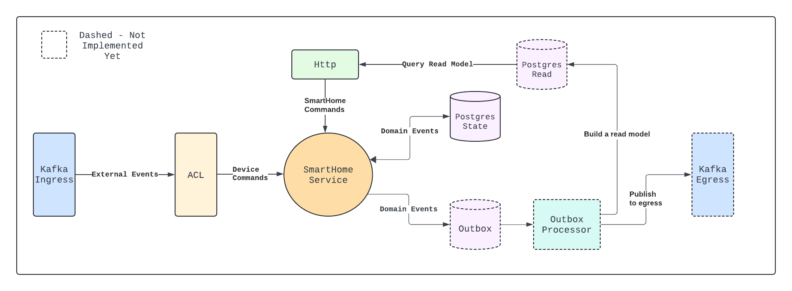

# smart-home-service
### IoT SmartHome Application built with Typelevel Ecosystem

## State: Work In Progress (mind the mess...)

This service orchestrates smart home devices by processing commands, updating the SmartHome state, and maintaining a comprehensive event log for state changes. We employ CQRS to separate the read and write operations and use Kafka as the message broker to ensure service isolation.

 Currently thinking that aspects of the SmartHome API will be accessible via a REST/gRPC endpoint, things like Adding Devices, setting 
properties of the SmartHome itself (min max allowed temperatures, personal settings for alerts, etc) and then information about Devices will be consumed via Kafka.

In order to build out the read model as well as the kafka egress I will make use of the Outbox Pattern. I will transactionally persist both the domain events for the state as well as in an outbox.

### Note: There is no runnable Main yet. As I'm building out and testing the components I'm using <i>ApplicationSpec</i> as the playground to wire up everything, test it out, fix, refactor, etc.  Once I'm happy with all the pieces working together then I will build the runnable main

### SmartHomeService Algebra
The API for the service comes in two flavours, <i>SmartHome</i> commands and information about <i>Device</i> events. 

The user will have the ability to modify things about a SmartHome, such as adding a new device, creating rules about things like temperature settings and retrieving
information about the home itself. This will be achieved through a simple REST interface.  Whereas information pertaining to the outside world of devices and their status will be consumed through Kafka.

`AddDevice(homeId: UUID, device: Device)` 

`UpdateDevice(homeId: UUID, deviceId: UUID, newValue: DeviceValueType)` 

`GetSmartHome(homeId: UUID)` 

`SetTemperatureSettings(min: Int, max: Int)` 

## Experiment with Outbox pattern to build read model 

Originally I thought about just creating some database triggers to determine if changes have been made to the Write database and the project that out to build the read model but as I did some research on this I saw that the `Outbox Pattern` was seen as a good way to accomplish this so I'd like to experiment with that first. I will need to update the diagram
 
### Remaining work...
* Add postgres repo ✅
* integration tests with postgres repo ✅
* Add FSM to SmartHome ✅
* Create basic rule engine for SmartHome (✅) and Devices for validation (✅)
* Create proto definition for external api (representing device events from the outside world)
* Kafka ingress to ACL ✅
* OutboxProcessor to query outbox and publish to kafka / write to read model
* Postgres projection to Kafka egress
* Ensure complete separation of write and query side of the data model - Outbox pattern?
* Replace InMem implementations in integration tests with containerized versions (postgres, kakfa, etc...) ✅
* Add some more interesting home/device rules to show the power of Validated
* Use `Resource` for dependency injection?
* Create a NotificationService so any alerts the SmartHome user can be notified (motion detected, etc)

### Finished
~~## In Progress: Postgres Repo
Add postgres repo that can be used in an integration test to verify schema and correct usage of doobie library~~ 

~~## In Progress: Event Sourcing
We're implementing the event sourcing pattern to underpin our state management approach. By capturing all state changes as events and persisting them in an event store, we create an audit trail of activities within the home. This event log is crucial for reconstructing the SmartHome state, enabling accurate processing of incoming commands.~~

~~## In Progress: Kafka ingress consumer
Will use protobuf to define some external event that the service will consume from via Kafka, then translate that into the SmartHome api. Currently, I'm thinking that information about devices will come through the kafka ingress like we're reading stream of data from outside devices, whereas adding devices and adding properties about the home will come through a grpc or rest endpoint?~~ 

~~## In Progress: REST endpoint for Home commands 
Whereas for Device-level events (~~Add~~/Update) will be coming through kafka, the commands that are at the level of the Home will come through REST.  The user can create a SmartHome, Add Devices and set parameters (min/max temp, etc)I also think I may move the AddDevice
command to be at the home-level and simply just device changes come through kafka.~~ 
